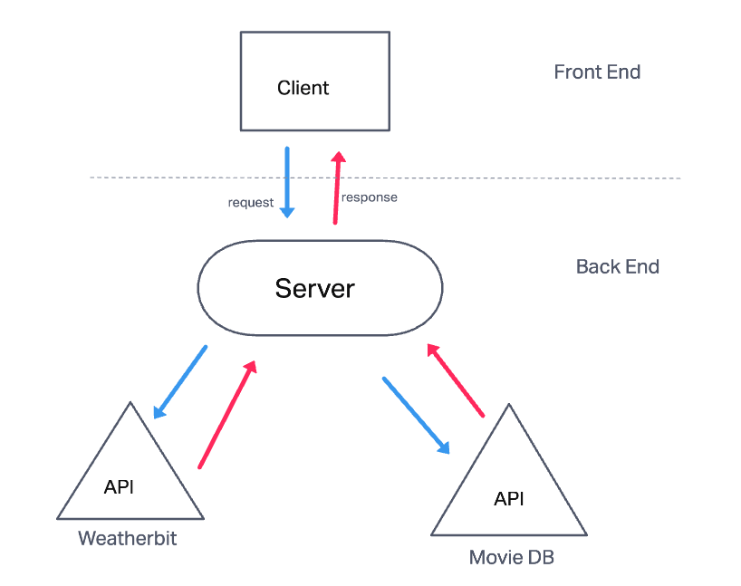

# City Search

## Todd Wolden

## Version 1.0

## Overview

## Getting Started

## Architecture

## Change Log

## Credit and Collaborations

1. Worked with Cody on the first dataFlow image. Help from Keyan than Ricardo for 2 & 3 on the wrrc. Help from Jason on some code I didn't use. Aubrey and Tracy for Lab09 and 10 respectively.

2. TA help from Brandon, Justin, Tammy, Matt, and JB.

Name of feature: Initial Website with return of city from api data

Estimate of time needed to complete: 4 hours

Start time: 2:30

Finish time: 6:30

Actual time needed to complete: about 4 hours

Name of feature: Asynchronous code, and APIs

Estimate of time needed to complete: 5 hours

Start time: 3pm

Finish time: 9pm

Actual time needed to complete: 6

Name of feature: Custom Servers with Node and Express

Estimate of time needed to complete: 5 hours

Start time:  6pm

Finish time: 12pm

Actual time needed to complete: 6 hours

Lab 06

Lab 07

Lab 08

Lab 09

Lab 10
